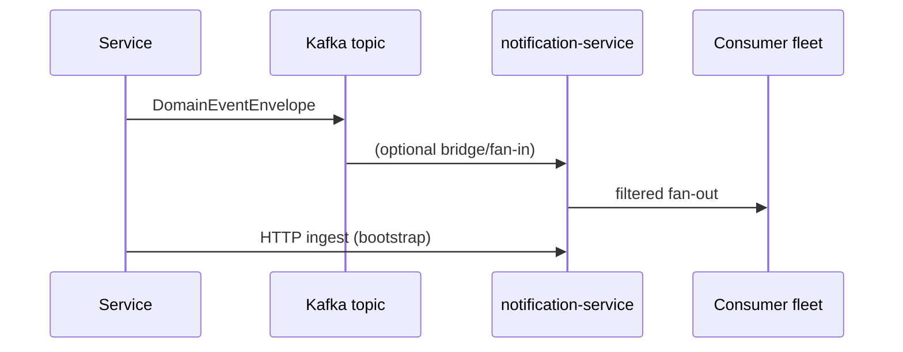

# Event flow (Kafka-ready)

1. Domain services emit `DomainEventEnvelope` (`@venext/shared-contracts`) into Kafka topics (naming convention: `venext.<bounded_context>.v1`).
2. `notification-service` exposes an HTTP ingest bridge (`POST /v1/events/ingest`) for sidecars during early rollout; later replaced by native consumers.
3. Downstream processors (push, email, partner webhooks) subscribe with idempotent handlers keyed by `eventId`.
4. `audit_events` captures governance actions in parallel for backoffice queries.

