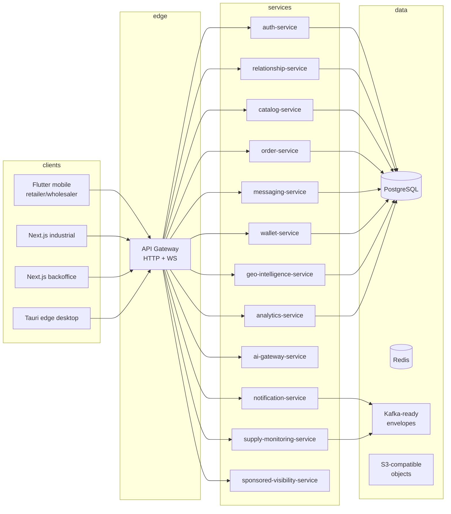

# VENEXT system overview

## Topology

## Principles encoded in this repo

- **Simplicity outside**: thin HTTP/WS edges, predictable health endpoints.
- **Sophistication inside**: composable roles, relationship-gated visibility, feature-flag dimensions, event envelopes.
- **African network reality**: mobile client uses aggressive retries; gateway records correlation + optional network hints; SQL schema supports lightweight geo signals without mandatory PostGIS in dev.
